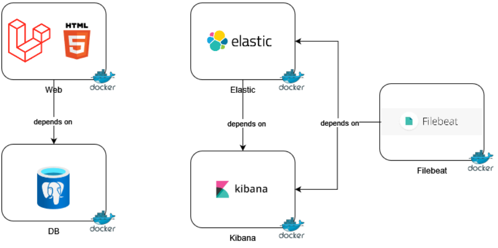

# HTTP honeypot

**Name:** Fedor Viest

**Subject:** BVI (Internet Security)

**Due date:** 9.5.2024

This repository contains the website and configuration files for deployment of HTTP honeypot. 
The project consists of website application written in PHP Laravel framework and HTML, CSS< Bootstrap, Javascript. The
project is dockerized. For logging it uses elasticsearch and Kibana and it uses filebeat to transfer logs from application
to elastic.

Application architecture:


Docker architecture:




### Deployment

The application was tested on Ubuntu Linux and Ubuntu Server 20.04. To deploy docker-compose must be installed. For Ubuntu 
docker can be installed using command:
```
sudo snap install docker-compose –classic
```

To verify the installation use command:
```
docker-compose --version
```

To download the entire application with configuration files, se git to clone the application onto your machine:
```
git clone https://github.com/FedorViest/BVI.git
```

This will create directory BVI on your machine. Change directory, to be in **BVI/** and create .env file. 
You can either copy example copy provided in this readme or create your own .env configuration for your application, however 
changing dockerfiles might be necessary. The example of .env file used during testing:
```
APP_NAME=Laravel
APP_ENV=local
APP_KEY=base64:iBQGzh1pTPMwHgHjgpImjnBTRbxAAXCtgDqy3J55BD4=
APP_DEBUG=true
APP_URL=http://localhost

LOG_CHANNEL=stack
LOG_DEPRECATIONS_CHANNEL=null
LOG_LEVEL=debug

DB_CONNECTION=pgsql
DB_HOST=db
DB_PORT=5432
DB_DATABASE=bvi
DB_USERNAME=postgres
DB_PASSWORD=postgres

BROADCAST_DRIVER=log
CACHE_DRIVER=file
FILESYSTEM_DISK=local
QUEUE_CONNECTION=sync
SESSION_DRIVER=file
SESSION_LIFETIME=120

MEMCACHED_HOST=127.0.0.1

REDIS_HOST=127.0.0.1
REDIS_PASSWORD=null
REDIS_PORT=6379

MAIL_MAILER=smtp
MAIL_HOST=mailpit
MAIL_PORT=1025
MAIL_USERNAME=null
MAIL_PASSWORD=null
MAIL_ENCRYPTION=null
MAIL_FROM_ADDRESS="hello@example.com"
MAIL_FROM_NAME="${APP_NAME}"

AWS_ACCESS_KEY_ID=
AWS_SECRET_ACCESS_KEY=
AWS_DEFAULT_REGION=us-east-1
AWS_BUCKET=
AWS_USE_PATH_STYLE_ENDPOINT=false

PUSHER_APP_ID=
PUSHER_APP_KEY=
PUSHER_APP_SECRET=
PUSHER_HOST=
PUSHER_PORT=443
PUSHER_SCHEME=https
PUSHER_APP_CLUSTER=mt1

VITE_PUSHER_APP_KEY="${PUSHER_APP_KEY}"
VITE_PUSHER_HOST="${PUSHER_HOST}"
VITE_PUSHER_PORT="${PUSHER_PORT}"
VITE_PUSHER_SCHEME="${PUSHER_SCHEME}"
VITE_PUSHER_APP_CLUSTER="${PUSHER_APP_CLUSTER}"
```

To start docker containers use command:
```
sudo docker-compose up –build -d –force-recreate
```
